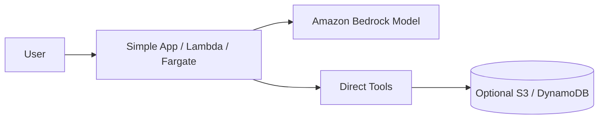
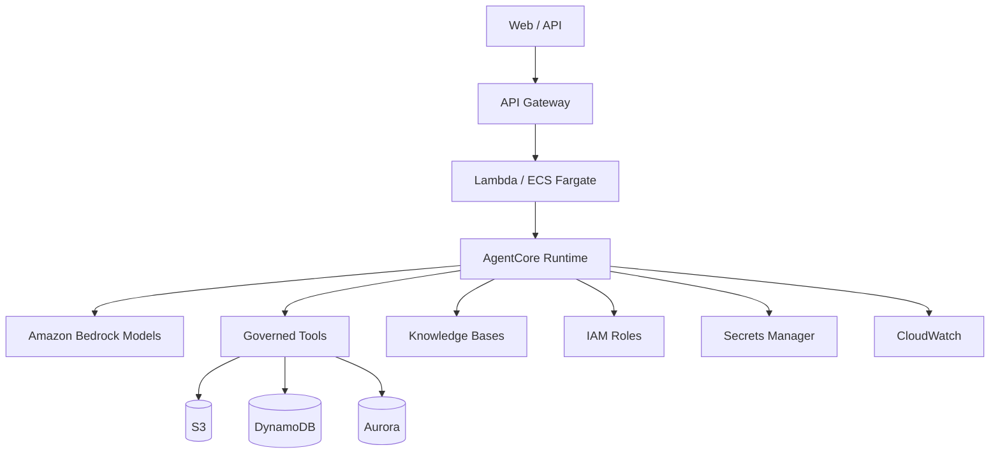
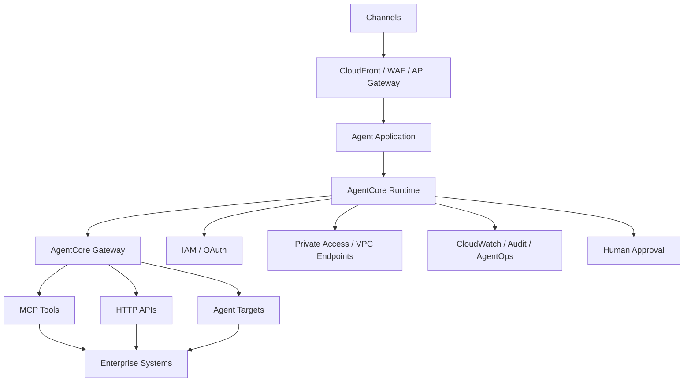

# AWS Agentic Reference Architecture

Status: CURRENT  
Evidence: OFFICIAL  
Review cadence: weekly

## FAST DEMO

Use AgentCore Runtime only when the demo actually needs a managed agent runtime.

Avoid by default:
- EKS
- private multi-account topology
- complex gateways
- dedicated clusters

## MVP

Recommended baseline:
- AgentCore Runtime where managed agent execution is required
- Bedrock
- explicit IAM roles
- Secrets Manager
- CloudWatch
- governed tool contracts
- Knowledge Bases when RAG is required

## PRODUCT

Add only when justified:
- AgentCore Gateway
- centralized inbound/outbound authorization
- private networking / VPC endpoints
- cross-account controls
- multi-agent
- HITL
- release gates
- persistent/durable state

## Variants

### Single Agent
Bedrock + AgentCore Runtime where needed.

### RAG Agent
Add Bedrock Knowledge Bases or selected vector store.

### Multi-Agent
Use only when independent agents or security/ownership boundaries justify it.

### MCP / Enterprise Tool Access
Use AgentCore Gateway when centralized tool discovery, MCP access and authorization materially improve governance.

## Current platform note

AgentCore Gateway provides a unified connectivity layer between agents and tools/resources and supports MCP-based access to configured targets.

## Executive rationale

### FAST DEMO — Executive purpose
> Validate the business behavior using Bedrock and a lightweight application runtime before introducing a managed agent platform.

| Component | C-Level explanation | Why now | Trigger to evolve |
|---|---|---|---|
| Simple App / Lambda / Fargate | Hosts the minimum application logic. | Fast, low-overhead execution. | Need for managed agent lifecycle or stronger runtime controls. |
| Amazon Bedrock Model | Provides reasoning and language capability. | Core AI capability. | Model quality, latency, cost, or routing changes. |
| Direct Tools | Connect the model to useful actions/data. | Enough to prove the use case. | More tools, shared governance, or privileged actions. |
| Optional S3 / DynamoDB | Provides lightweight storage or knowledge. | Added only if persistence is needed. | Larger data, transactional needs, or richer retrieval. |

**Why not more?** AgentCore, EKS, complex gateways, private multi-account topology, and dedicated clusters are not introduced until there is a concrete need.

### MVP — Executive purpose
> Establish a managed agent runtime with real integrations, identity, observability, and controlled knowledge access.

| Component | C-Level explanation | Why now | Trigger to evolve |
|---|---|---|---|
| API Gateway | Provides a managed API entry point. | Makes the solution reusable across channels. | Global delivery, WAF, or broader API governance. |
| Lambda / ECS Fargate | Hosts application logic around the agent. | Supports serverless or containerized integration patterns. | Sustained load or more specialized runtime. |
| AgentCore Runtime | Provides managed execution for agents. | Introduces dedicated agent lifecycle management. | Gateway, multi-agent, or enterprise tool governance. |
| Bedrock Models | Provide the core AI models. | Central enterprise model access. | Model portfolio/routing needs. |
| Governed Tools | Define controlled capabilities the agent can use. | MVP must prove safe and repeatable integrations. | Shared tool gateway, privileged writes, or policy enforcement. |
| Knowledge Bases | Grounds the agent in enterprise information. | Added when answers require controlled knowledge. | Permission-aware retrieval or specialized vector architecture. |
| S3 / DynamoDB / Aurora | Provide object, key-value, or relational persistence. | Real workloads need durable data/state. | HA, cross-region, DR, or scale needs. |
| IAM Roles | Control what the runtime can access. | Enables enterprise identity and least privilege. | Cross-account or finer-grained authorization. |
| Secrets Manager | Protects credentials. | Avoids embedded secrets. | Advanced rotation or external secret integration. |
| CloudWatch | Provides logs, metrics, and operational visibility. | Makes the MVP supportable. | AgentOps, audit, SIEM, or SLO requirements. |

### PRODUCT — Executive purpose
> Operate agents as governed enterprise services with centralized access to tools, private connectivity, auditability, and human control.

| Component | C-Level explanation | Why now | Business trigger |
|---|---|---|---|
| CloudFront / WAF / API Gateway | Protects and governs enterprise access. | Required for external exposure and API security policies. | Production channels and API governance. |
| Agent Application | Owns the product-specific business experience. | Separates business logic from underlying agent infrastructure. | Independent release and ownership requirements. |
| AgentCore Runtime | Runs agents in a managed environment. | Supports reliable enterprise execution. | Production-grade managed agent workload. |
| AgentCore Gateway | Centralizes governed access to tools, APIs, and agents. | Reduces duplicated integration/security logic. | Shared tools, MCP, A2A, or cross-team agent ecosystems. |
| MCP Tools / HTTP APIs / Agent Targets | Expose enterprise capabilities through controlled interfaces. | Supports standard and governed interoperability. | Growth in tools/agents or multiple consumers. |
| IAM / OAuth | Enforces deterministic identity and authorization. | Production cannot rely on prompts for access control. | Sensitive data/actions and multi-user access. |
| Private Access / VPC Endpoints | Keeps sensitive traffic within controlled network boundaries. | Added when security or compliance requires it. | Regulated or high-sensitivity workloads. |
| CloudWatch / Audit / AgentOps | Provides operational, audit, and behavior visibility. | Production must be supportable and accountable. | Enterprise operations, audit, or cost governance. |
| Human Approval | Controls consequential actions. | Required for high-risk, irreversible, or privileged actions. | Risk/policy thresholds. |

**Executive message:** AWS evolves from direct Bedrock usage to AgentCore only when managed agent lifecycle, shared tool governance, or enterprise-scale controls justify the extra architecture.
