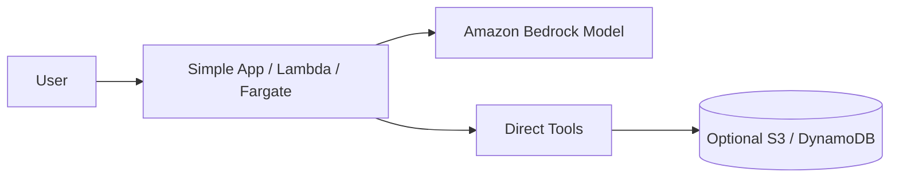
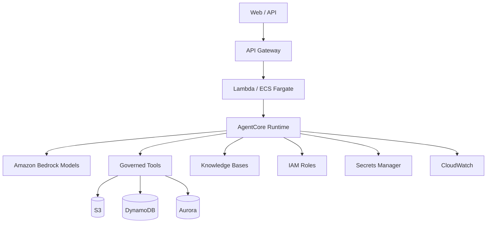
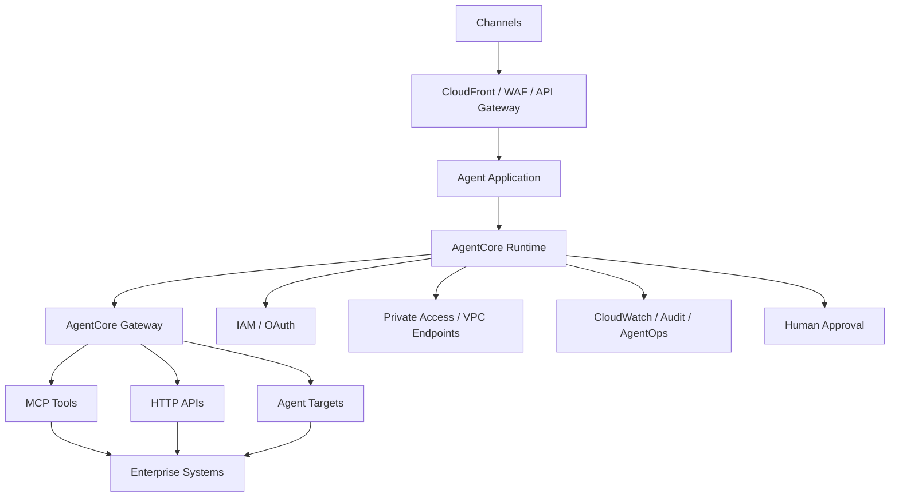

# AWS Agentic Reference Architecture

Status: CURRENT  
Evidence: OFFICIAL  
Review cadence: weekly

## FAST DEMO

Use AgentCore Runtime only when the demo actually needs a managed agent runtime.

Avoid by default:
- EKS
- private multi-account topology
- complex gateways
- dedicated clusters

## MVP

Recommended baseline:
- AgentCore Runtime where managed agent execution is required
- Bedrock
- explicit IAM roles
- Secrets Manager
- CloudWatch
- governed tool contracts
- Knowledge Bases when RAG is required

## PRODUCT

Add only when justified:
- AgentCore Gateway
- centralized inbound/outbound authorization
- private networking / VPC endpoints
- cross-account controls
- multi-agent
- HITL
- release gates
- persistent/durable state

## Variants

### Single Agent
Bedrock + AgentCore Runtime where needed.

### RAG Agent
Add Bedrock Knowledge Bases or selected vector store.

### Multi-Agent
Use only when independent agents or security/ownership boundaries justify it.

### MCP / Enterprise Tool Access
Use AgentCore Gateway when centralized tool discovery, MCP access and authorization materially improve governance.

## Current platform note

AgentCore Gateway provides a unified connectivity layer between agents and tools/resources and supports MCP-based access to configured targets.
