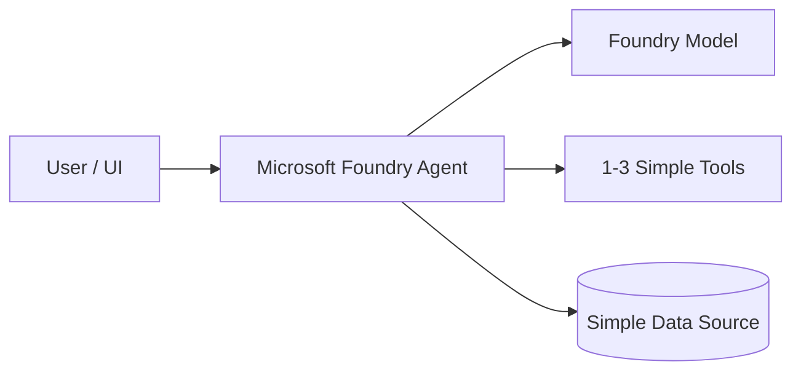
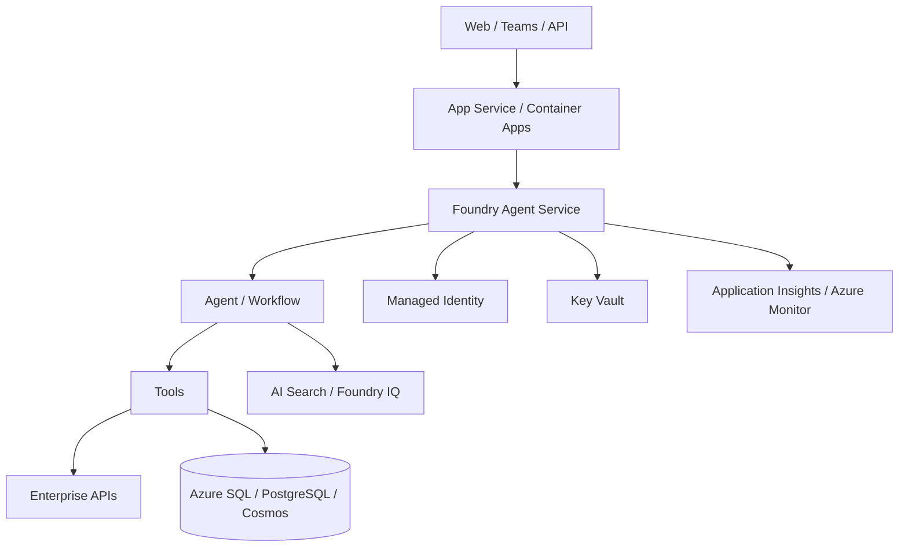
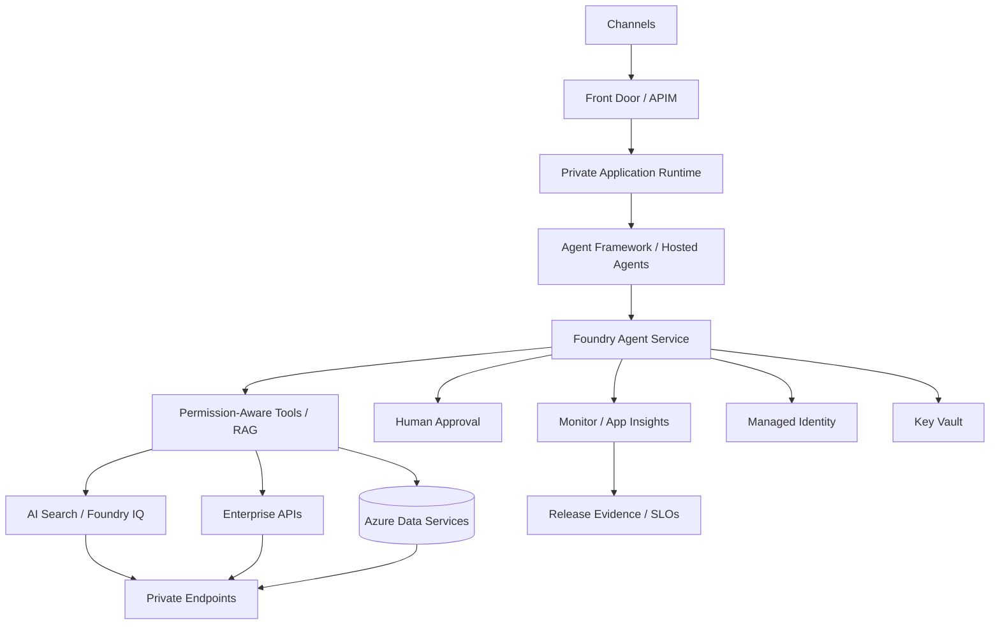

# Azure Agentic Reference Architecture

Status: CURRENT  
Evidence: OFFICIAL  
Review cadence: weekly

## FAST DEMO

Recommended baseline:
- Microsoft Foundry
- Prompt Agent or Hosted Agent depending code control needed
- model deployment
- direct/simple tools
- optional Azure AI Search / Foundry IQ if knowledge is required

Avoid unless required:
- VNet/private endpoints
- APIM
- Redis
- AKS
- multi-agent topology
- dedicated infrastructure

## MVP

Recommended baseline:
- Foundry Agent Service
- Agent Framework when code-first orchestration is needed
- App Service / Container Apps when a separate application shell is needed
- Managed Identity
- Key Vault
- Azure Monitor / Application Insights
- explicit tool contracts
- eval dataset
- AI Search / Foundry IQ when knowledge retrieval is required

## PRODUCT

Add only when requirements justify:
- private networking / private endpoints
- API Management
- WAF / Front Door
- durable execution
- permission-aware retrieval
- multi-agent orchestration
- HITL
- release gates
- rollback
- operational SLOs

## Variants

### Single Agent
Default starting pattern.

### RAG Agent
Add AI Search / Foundry IQ only when external/private knowledge is required.

### Multi-Agent
Use when specialist boundaries, security separation, or prompt/tool complexity justify it.

### Long-Running
Use durable execution when the task cannot safely complete within a normal request lifecycle.

## Current platform note

Microsoft Foundry Hosted Agents are GA and run containerized agent code on Microsoft-managed infrastructure, including scaling, session state, identity and lifecycle management.

## Executive rationale

### FAST DEMO — Executive purpose
> Prove agentic value with minimum infrastructure and cost.

| Component | C-Level explanation | Why now | Trigger to evolve |
|---|---|---|---|
| User / UI | Business entry point. | Needed to validate the journey. | More channels or enterprise rollout. |
| Microsoft Foundry Agent | Runs agent behavior and tool orchestration. | Fastest managed path to prove the use case. | Custom orchestration, independent runtime, or stronger lifecycle control. |
| Foundry Model | Provides reasoning and language understanding. | Core intelligence. | Quality, latency, routing, or cost needs change. |
| Simple Tools | Connect the agent to useful actions/data. | Demonstrates business utility beyond chat. | More tools, privileged writes, or governance needs. |
| Simple Data Source | Provides minimum business context. | Enough to validate relevance. | Larger corpus, permissions, or semantic requirements. |

**Why not more?** VNet, APIM, Redis, AKS, multi-agent topology, and private endpoints stay out until risk, scale, or isolation justify them.

### MVP — Executive purpose
> Turn a working demo into a repeatable, integrated, observable product.

| Component | C-Level explanation | Why now | Trigger to evolve |
|---|---|---|---|
| App Service / Container Apps | Runs the product-facing application. | Separates UX from agent runtime and supports repeatable deployment. | Stronger isolation or specialized runtime. |
| Foundry Agent Service | Provides managed agent lifecycle. | Adds repeatability and operational control. | Complex orchestration or custom runtime. |
| Agent / Workflow | Encapsulates business behavior. | Makes logic explicit and testable. | Multi-agent or durable workflow needs. |
| Tools | Connect the agent to enterprise capabilities. | MVP must prove real integrations. | Shared tool governance, MCP, or high-risk actions. |
| AI Search / Foundry IQ | Grounds answers in enterprise knowledge. | Added when traceable knowledge is required. | Permission-aware retrieval or richer search. |
| Enterprise APIs | Connect to operational systems. | Proves end-to-end business value. | More integrations or higher transaction criticality. |
| Azure SQL / PostgreSQL / Cosmos | Stores state/domain data. | Real persistence is needed beyond a demo. | HA, DR, or higher scale. |
| Managed Identity | Gives the solution a controlled identity. | Enables least privilege without embedded credentials. | Finer-grained identity separation. |
| Key Vault | Protects secrets. | Required for real integrations. | Stronger rotation/compliance needs. |
| App Insights / Azure Monitor | Provides health and performance visibility. | Makes the MVP supportable. | SLOs, AgentOps, or enterprise observability. |

### PRODUCT — Executive purpose
> Operate the agent as a secure, governed, resilient enterprise capability.

| Component | C-Level explanation | Why now | Business trigger |
|---|---|---|---|
| Front Door / APIM | Controls and protects enterprise access. | Central policy and exposure management. | External access or API governance. |
| Private Application Runtime | Runs inside controlled boundaries. | Protects sensitive workloads. | Security or compliance requirement. |
| Agent Framework / Hosted Agents | Provides stronger orchestration and code lifecycle. | Agent logic becomes an enterprise asset. | Multi-agent, custom runtime, or separate release cycles. |
| Permission-Aware Tools / RAG | Enforces deterministic authorization. | Production trust cannot rely on prompts. | Sensitive data/actions. |
| AI Search / Foundry IQ | Provides governed retrieval. | Production grounding must be consistent and auditable. | Scale, freshness, or richer retrieval. |
| Enterprise APIs / Data Services | Execute real business processes. | Production creates or influences real outcomes. | Higher business criticality. |
| Human Approval | Keeps people in consequential decisions. | Required for high-impact or irreversible actions. | Risk/policy threshold. |
| Managed Identity / Key Vault | Enforces identity and secret governance. | Baseline enterprise security. | More segregation or compliance. |
| Private Endpoints | Keeps sensitive traffic private. | Added when network isolation is required. | Security architecture or regulation. |
| Monitor / App Insights | Supports operations, audit, and incident response. | Production must be observable. | SLO/audit obligations. |
| Release Evidence / SLOs | Proves a version is safe to promote. | Enables governed release decisions. | Any critical production workload. |

**Executive message:** FAST DEMO proves value; MVP proves repeatability; PRODUCT adds only the controls required to trust the solution in real operations.
