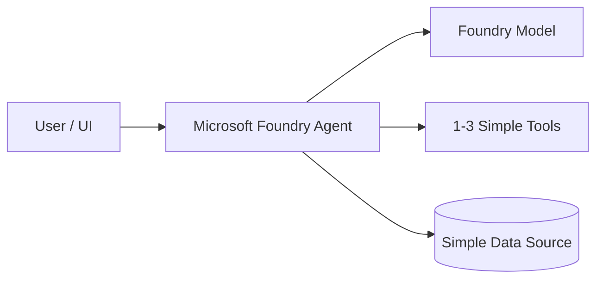
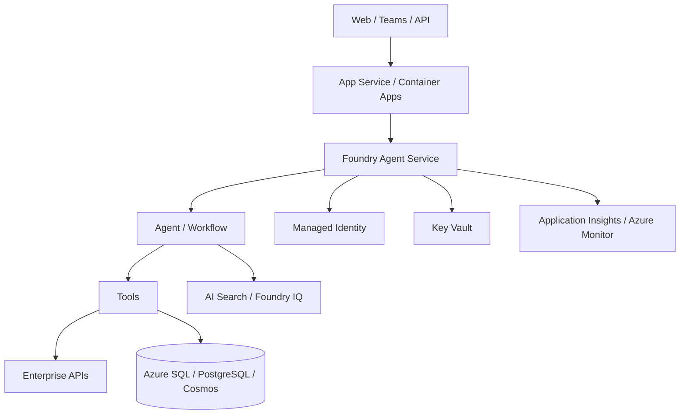
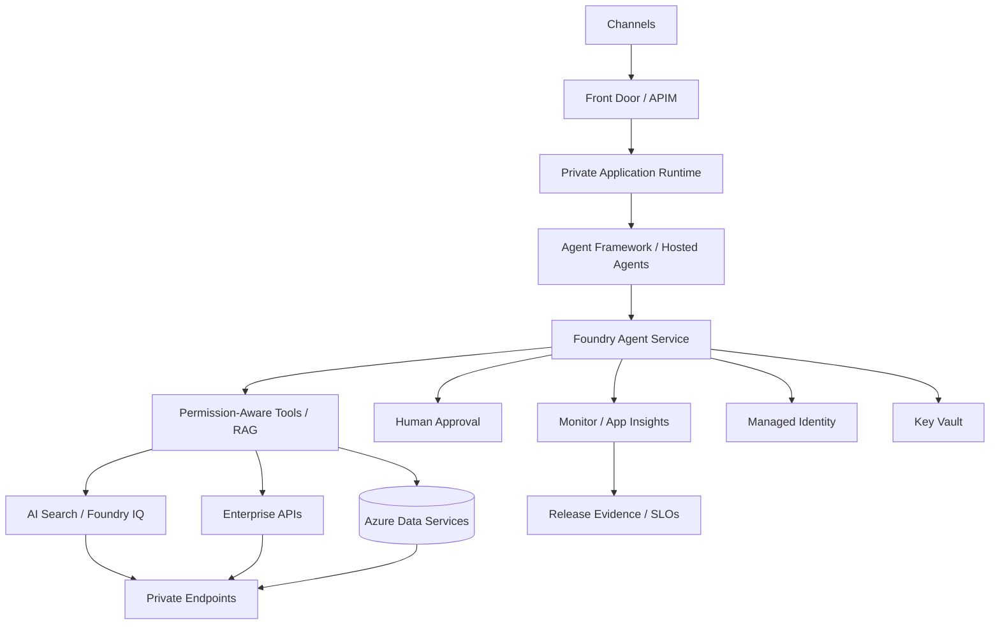

# Azure Agentic Reference Architecture

Status: CURRENT  
Evidence: OFFICIAL  
Review cadence: weekly

## FAST DEMO

Recommended baseline:
- Microsoft Foundry
- Prompt Agent or Hosted Agent depending code control needed
- model deployment
- direct/simple tools
- optional Azure AI Search / Foundry IQ if knowledge is required

Avoid unless required:
- VNet/private endpoints
- APIM
- Redis
- AKS
- multi-agent topology
- dedicated infrastructure

## MVP

Recommended baseline:
- Foundry Agent Service
- Agent Framework when code-first orchestration is needed
- App Service / Container Apps when a separate application shell is needed
- Managed Identity
- Key Vault
- Azure Monitor / Application Insights
- explicit tool contracts
- eval dataset
- AI Search / Foundry IQ when knowledge retrieval is required

## PRODUCT

Add only when requirements justify:
- private networking / private endpoints
- API Management
- WAF / Front Door
- durable execution
- permission-aware retrieval
- multi-agent orchestration
- HITL
- release gates
- rollback
- operational SLOs

## Variants

### Single Agent
Default starting pattern.

### RAG Agent
Add AI Search / Foundry IQ only when external/private knowledge is required.

### Multi-Agent
Use when specialist boundaries, security separation, or prompt/tool complexity justify it.

### Long-Running
Use durable execution when the task cannot safely complete within a normal request lifecycle.

## Current platform note

Microsoft Foundry Hosted Agents are GA and run containerized agent code on Microsoft-managed infrastructure, including scaling, session state, identity and lifecycle management.
