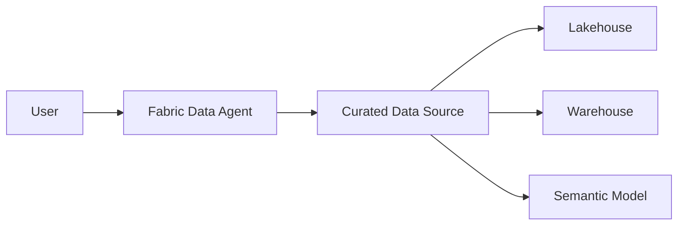
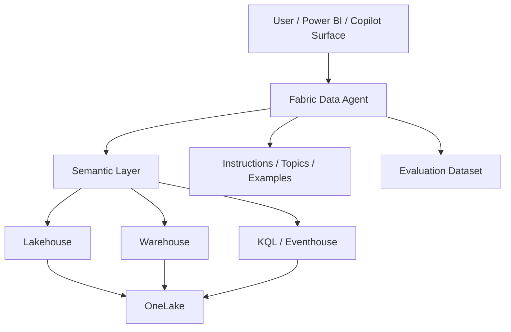
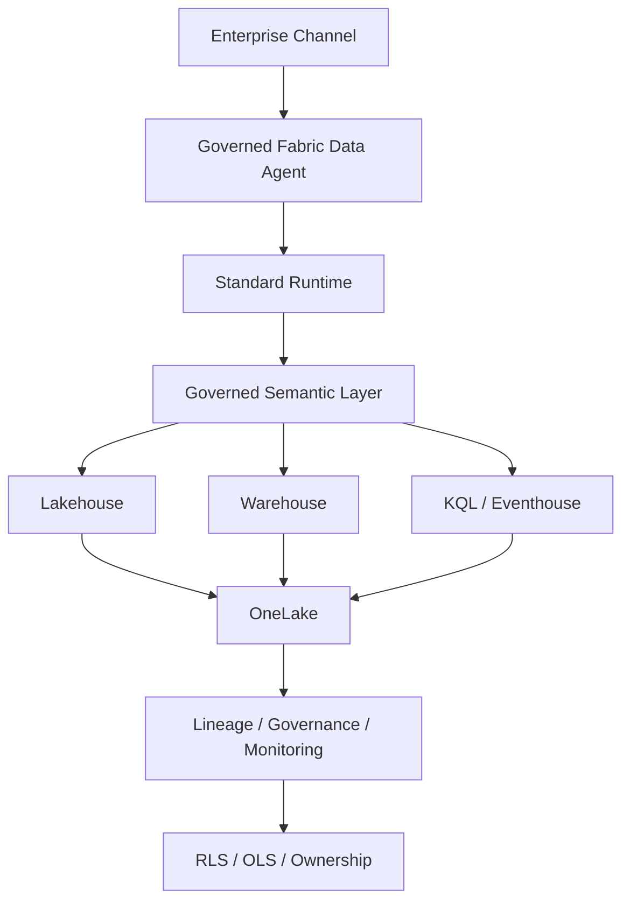

# Microsoft Fabric Data Agent Reference Architecture

Status: CURRENT  
Evidence: OFFICIAL  
Review cadence: weekly

Fabric is treated as a **data-agent / conversational analytics** architecture, not as a general-purpose agent runtime for all software.

## FAST DEMO

Minimum:
- one curated source
- basic instructions
- representative questions

## MVP

Add:
- curated semantic model
- source descriptions
- example queries
- evaluation dataset
- ownership

## PRODUCT

Add:
- standard runtime for production stability
- semantic ownership
- governed sources
- RLS/OLS where relevant
- lineage
- monitored runtime

## Key rule

> Fabric Data Agent is the agentic consumption layer for governed data; it is not the default runtime for general-purpose application agents.

## Executive rationale

### FAST DEMO — Executive purpose
> Prove that business users can ask questions in natural language and receive useful answers from a curated enterprise data source.

| Component | C-Level explanation | Why now | Trigger to evolve |
|---|---|---|---|
| User | Business consumer of conversational analytics. | Validates adoption and usability. | More channels or enterprise distribution. |
| Fabric Data Agent | Translates business questions into governed data interactions. | Fastest way to prove conversational access to data. | Broader sources, semantic governance, or production runtime. |
| Curated Data Source | Limits the agent to trusted data. | Keeps the demo controlled and understandable. | More domains or a larger governed data estate. |
| Lakehouse / Warehouse / Semantic Model | Provide structured analytical sources. | Added according to the actual source already available. | Richer semantics, real-time data, or cross-domain analytics. |

### MVP — Executive purpose
> Make conversational analytics repeatable by adding a governed semantic layer, multiple supported sources, instructions, and evaluation.

| Component | C-Level explanation | Why now | Trigger to evolve |
|---|---|---|---|
| User / Power BI / Copilot Surface | Places the agent where business users already work. | MVP should validate adoption in realistic channels. | Broader enterprise distribution. |
| Fabric Data Agent | Provides the reusable conversational analytics layer. | Moves beyond a one-off demo. | Production governance and runtime stability needs. |
| Semantic Layer | Standardizes business meaning for metrics and entities. | Prevents the agent from guessing definitions from physical schemas. | Multi-domain semantic governance or shared enterprise metrics. |
| Lakehouse / Warehouse / KQL / Eventhouse | Provide batch, warehouse, or real-time sources. | Supports the actual analytical pattern needed. | Scale, real-time criticality, or domain separation. |
| OneLake | Provides the shared Fabric data foundation. | Reduces copies and centralizes analytical data. | Capacity, residency, or domain governance requirements. |
| Instructions / Topics / Examples | Teach the agent how the business domain works. | Improves consistency and interpretation. | More domains or formal content governance. |
| Evaluation Dataset | Measures whether the agent answers correctly. | MVP must prove repeatable quality. | Formal regression and release gates. |

### PRODUCT — Executive purpose
> Operate conversational analytics as a governed enterprise capability with semantic ownership, row/object security, lineage, and monitored runtime behavior.

| Component | C-Level explanation | Why now | Business trigger |
|---|---|---|---|
| Enterprise Channel | Delivers the data agent through governed business experiences. | Production needs consistent access and ownership. | Enterprise rollout. |
| Governed Fabric Data Agent | Provides the controlled conversational interface. | Production requires managed behavior and source governance. | Ongoing operational ownership. |
| Standard Runtime | Provides production-oriented runtime stability. | Reduces variability for enterprise usage. | Production adoption. |
| Governed Semantic Layer | Establishes authoritative business meaning. | Critical for trusted enterprise answers. | Cross-domain or executive usage. |
| Lakehouse / Warehouse / KQL / Eventhouse | Supply governed analytical data. | Production uses authoritative enterprise sources. | Growth in domains, real-time needs, or capacity pressure. |
| OneLake | Provides the shared governed data foundation. | Simplifies enterprise data access and lineage. | Capacity or domain isolation needs. |
| Lineage / Governance / Monitoring | Shows source, ownership, usage, and operational health. | Required for trust, support, and auditability. | Production governance. |
| RLS / OLS / Ownership | Ensures users only see authorized data and accountability is explicit. | Required when access differs by role. | Sensitive or regulated data. |

**Executive message:** Fabric Data Agent is about trusted conversational analytics. The architecture matures by strengthening semantics, governance, security, and monitoring—not by adding a generic application runtime.
