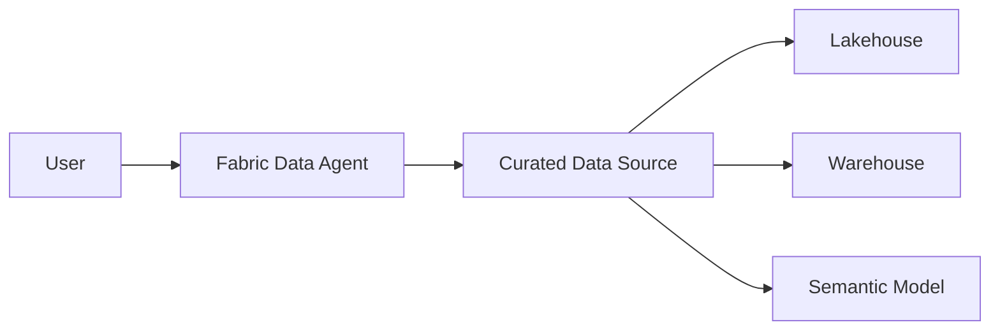
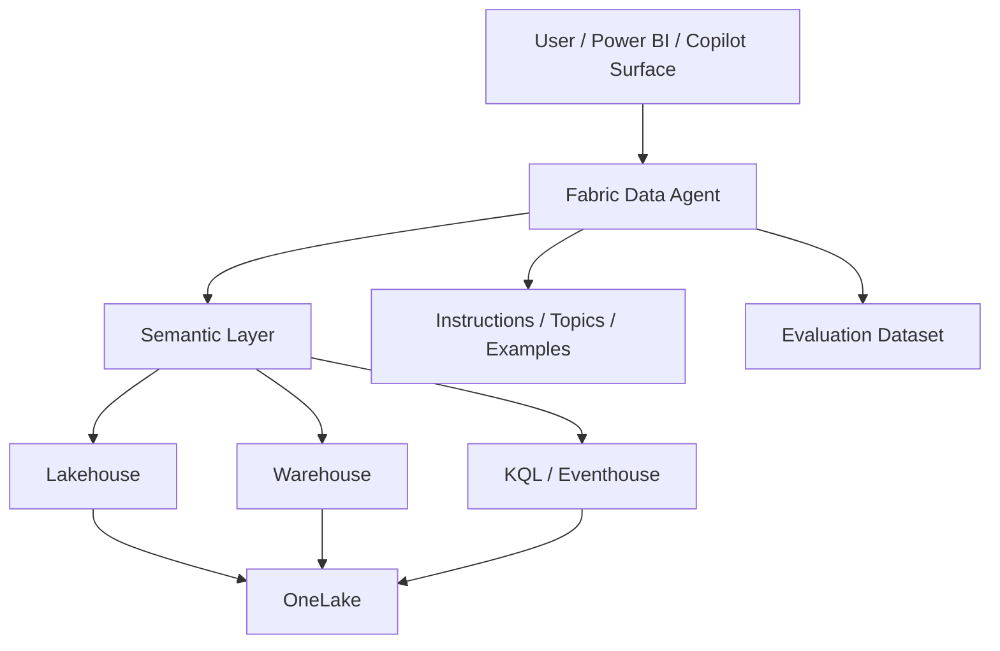
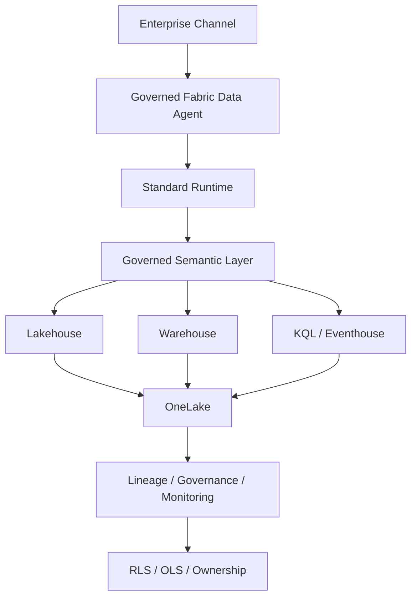

# Microsoft Fabric Data Agent Reference Architecture

Status: CURRENT  
Evidence: OFFICIAL  
Review cadence: weekly

Fabric is treated as a **data-agent / conversational analytics** architecture, not as a general-purpose agent runtime for all software.

## FAST DEMO

Minimum:
- one curated source
- basic instructions
- representative questions

## MVP

Add:
- curated semantic model
- source descriptions
- example queries
- evaluation dataset
- ownership

## PRODUCT

Add:
- standard runtime for production stability
- semantic ownership
- governed sources
- RLS/OLS where relevant
- lineage
- monitored runtime

## Key rule

> Fabric Data Agent is the agentic consumption layer for governed data; it is not the default runtime for general-purpose application agents.
