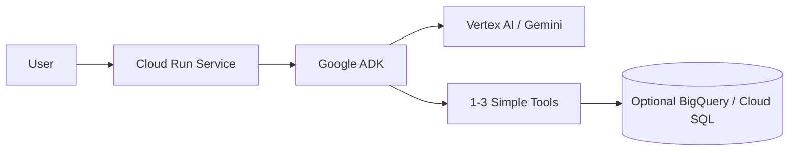
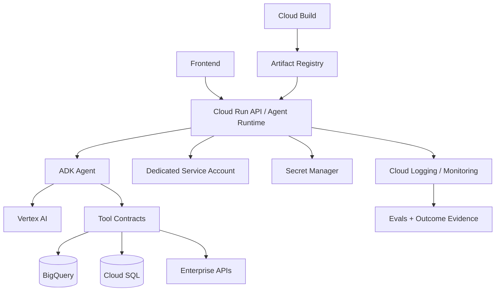
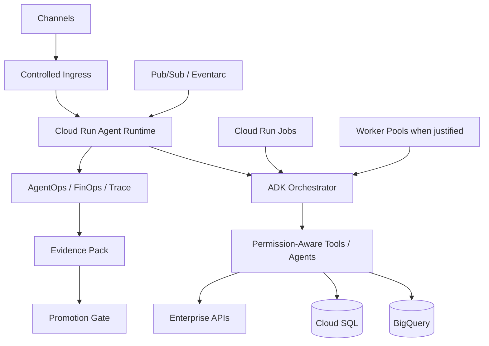

# GCP Agentic Reference Architecture

Status: CURRENT  
Evidence: PROVEN + OFFICIAL  
Review cadence: weekly

Proven by DevPattern reference implementations including DataGob, Business Rules Silver, and PricingPrima.

## FAST DEMO

Recommended baseline:
- Cloud Run Service
- Google ADK
- Vertex AI / Gemini
- simple tools
- optional BigQuery / Cloud SQL
- scale-to-zero where appropriate

Avoid by default:
- GKE
- service mesh
- dedicated clusters
- unnecessary private networking
- multi-agent

## MVP

Recommended baseline:
- Cloud Run
- ADK
- Vertex AI
- dedicated service account
- Secret Manager
- Cloud Logging / Monitoring
- Artifact Registry
- Cloud Build
- explicit tool contracts
- eval dataset
- outcome evidence

## PRODUCT

Add only when justified:
- private ingress
- VPC connectivity
- PSC
- Cloud NAT
- Pub/Sub/Eventarc
- Worker Pools
- Cloud Run Jobs
- multi-agent
- durable approval state
- release promotion/rollback

## Cloud Run resource rule

- Service: request-driven agent
- Job: run-to-completion / batch / eval
- Worker Pool: background agent fleet
- Instance: dedicated stateful singleton loop

## Key rule

> Cloud Run remains the default until a concrete workload limitation proves the need for another runtime.

## Executive rationale

### FAST DEMO — Executive purpose
> Prove the use case with the fewest moving parts and a scale-to-zero cost model.

| Component | C-Level explanation | Why now | Trigger to evolve |
|---|---|---|---|
| Cloud Run Service | Executes the agent on demand without server management. | Low operating overhead and cost for intermittent usage. | Sustained traffic, background work, or runtime constraints. |
| Google ADK | Organizes agent behavior, tools, and orchestration. | Gives structure without unnecessary platform complexity. | Multi-agent, durable execution, or interoperability needs. |
| Vertex AI / Gemini | Provides reasoning and language understanding. | Core cognitive capability. | Quality, latency, routing, or cost requirements change. |
| Simple Tools | Connect the agent to useful actions/data. | Demonstrates business utility. | More tools, side effects, or stronger governance. |
| Optional BigQuery / Cloud SQL | Provides persistence or analytics when needed. | Added only if the use case requires it. | Larger data, stronger consistency, HA, or transactional needs. |

**Why not more?** GKE, service mesh, dedicated clusters, private networking, and multi-agent stay out until evidence justifies them.

### MVP — Executive purpose
> Make the agent repeatable, integrated, observable, and deployable through a controlled software lifecycle.

| Component | C-Level explanation | Why now | Trigger to evolve |
|---|---|---|---|
| Cloud Run API / Agent Runtime | Runs the product and agent with managed autoscaling. | Production-like runtime without infrastructure overhead. | Specialized runtime or stronger isolation. |
| ADK Agent | Encapsulates agent behavior. | Makes reasoning and tool use explicit and testable. | Multi-agent or long-running orchestration. |
| Vertex AI | Centralizes enterprise model access. | Supports governed model consumption. | Model routing, regional, or specialized model needs. |
| Tool Contracts | Define what the agent can call and with what schema. | Reduces unsafe or ambiguous integrations. | Shared tool platform, MCP, or higher-risk actions. |
| BigQuery | Provides governed analytical data. | Common source for enterprise analytics. | Semantic layer, row-level controls, or workload isolation. |
| Cloud SQL | Stores transactional/application state. | Needed when durable relational state appears. | HA, replicas, private connectivity, DR. |
| Enterprise APIs | Connect to business systems. | Proves real end-to-end value. | More integrations or transactional impact. |
| Dedicated Service Account | Gives the runtime a controlled identity. | Enables least privilege. | More granular identity separation. |
| Secret Manager | Protects credentials and secrets. | Removes hard-coded secrets. | Advanced rotation/compliance. |
| Cloud Logging / Monitoring | Provides operational visibility. | MVP must be diagnosable. | AgentOps, SLOs, SIEM, or distributed tracing. |
| Cloud Build / Artifact Registry | Creates repeatable deployments. | Turns the demo into managed software delivery. | Multi-environment promotion or advanced governance. |
| Evals + Outcome Evidence | Measures quality and business result. | MVP must prove consistent performance. | Formal release gates and regression suites. |

### PRODUCT — Executive purpose
> Operate the agent as a governed enterprise service with controlled access, asynchronous scale, measurable cost, and release assurance.

| Component | C-Level explanation | Why now | Business trigger |
|---|---|---|---|
| Controlled Ingress | Governs how channels reach the service. | Centralizes exposure and security control. | External access, regulation, or API governance. |
| Cloud Run Agent Runtime | Remains the managed execution baseline. | Keeps operations simple while scaling to demand. | Proven runtime limitation only. |
| ADK Orchestrator | Coordinates tools or specialist agents. | Added when orchestration complexity becomes material. | Multiple domains or specialist agents. |
| Permission-Aware Tools / Agents | Enforces deterministic access control. | Production must respect enterprise permissions. | Sensitive data or privileged actions. |
| BigQuery / Cloud SQL / APIs | Provide authoritative business data and actions. | Production integrates with real systems. | Higher scale, criticality, or governance. |
| Pub/Sub / Eventarc | Triggers agentic work asynchronously. | Added for event-driven processes. | Decoupling, bursts, or background processing. |
| Cloud Run Jobs | Handles run-to-completion work. | Better fit for batch, evals, or scheduled tasks. | Long-running batch/eval workloads. |
| Worker Pools | Supports persistent background fleets. | Only for continuous queue-consuming behavior. | Background concurrency or dedicated fleets. |
| AgentOps / FinOps / Trace | Measures quality, behavior, latency, and cost. | Enterprise trust needs operational and economic transparency. | Production support and budget accountability. |
| Evidence Pack | Captures proof that a candidate works. | Enables auditable release decisions. | Governed deployment lifecycle. |
| Promotion Gate | Prevents unsafe versions reaching production. | Converts evidence into a release decision. | Any critical production workload. |

**Executive message:** GCP stays simple while Cloud Run + ADK are sufficient; additional components appear only when scale, risk, asynchronous behavior, or governance require them.
