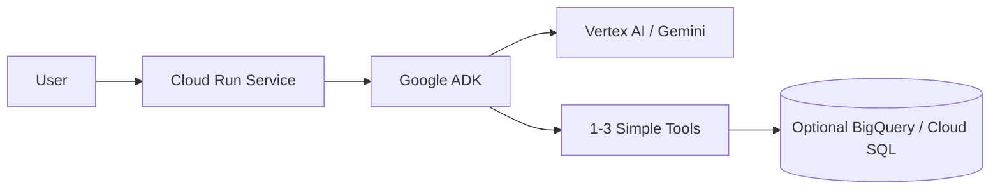
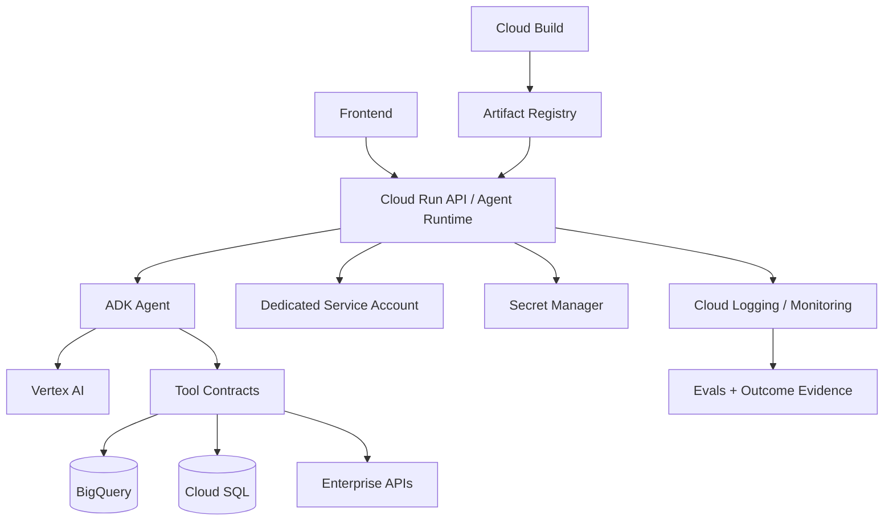
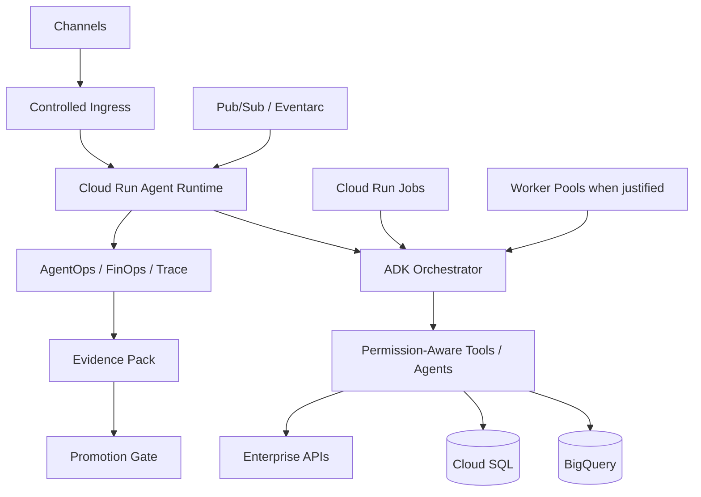

# GCP Agentic Reference Architecture

Status: CURRENT  
Evidence: PROVEN + OFFICIAL  
Review cadence: weekly

Proven by DevPattern reference implementations including DataGob, Business Rules Silver, and PricingPrima.

## FAST DEMO

Recommended baseline:
- Cloud Run Service
- Google ADK
- Vertex AI / Gemini
- simple tools
- optional BigQuery / Cloud SQL
- scale-to-zero where appropriate

Avoid by default:
- GKE
- service mesh
- dedicated clusters
- unnecessary private networking
- multi-agent

## MVP

Recommended baseline:
- Cloud Run
- ADK
- Vertex AI
- dedicated service account
- Secret Manager
- Cloud Logging / Monitoring
- Artifact Registry
- Cloud Build
- explicit tool contracts
- eval dataset
- outcome evidence

## PRODUCT

Add only when justified:
- private ingress
- VPC connectivity
- PSC
- Cloud NAT
- Pub/Sub/Eventarc
- Worker Pools
- Cloud Run Jobs
- multi-agent
- durable approval state
- release promotion/rollback

## Cloud Run resource rule

- Service: request-driven agent
- Job: run-to-completion / batch / eval
- Worker Pool: background agent fleet
- Instance: dedicated stateful singleton loop

## Key rule

> Cloud Run remains the default until a concrete workload limitation proves the need for another runtime.
