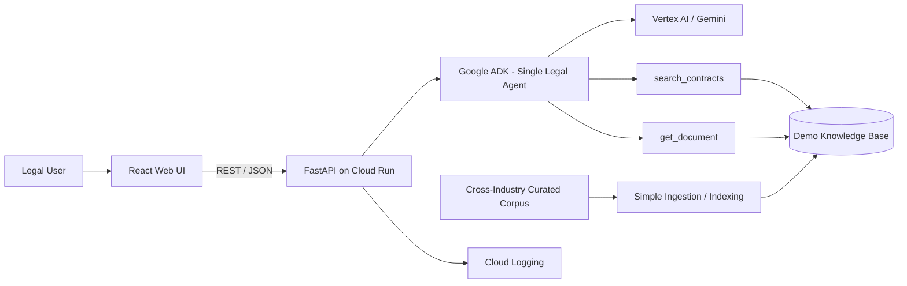

# GCP FAST DEMO Architecture — Cross-Industry Legal Contract Intelligence

## Executive intent

Prove cross-industry legal question-answering, clause analysis, comparison and source traceability with the fewest moving parts.

The demo is not tied to CENTRIA or any other client.

## Technology decisions

- Frontend: React
- Backend/API: FastAPI
- Agent framework: Google ADK
- Model: Vertex AI / Gemini
- Runtime: Cloud Run
- Retrieval: lightweight demo knowledge/retrieval component
- Observability: Cloud Logging

## Baseline



## Component rationale

| Concern | FAST DEMO choice | Why |
|---|---|---|
| Web UI | React | Simple reusable component model and clear UX boundary |
| Backend | FastAPI | Explicit Python API contract and natural fit with ADK/retrieval services |
| Backend runtime | Cloud Run Service | Managed request-driven workload |
| Frontend hosting | simplest GCP-compatible option selected during implementation | Do not add infrastructure only for symmetry |
| Agent framework | Google ADK | Proven GCP-native agent structure |
| Model | Vertex AI / Gemini | Core reasoning capability |
| Retrieval | Lightweight vector/retrieval layer | Enough to validate RAG value |
| Documents | Curated cross-industry digital corpus | Reusable and deterministic demo |
| Logs | Cloud Logging | Minimum diagnosability |
| Secrets | Secret Manager or deployment-appropriate secret injection | Never expose credentials to React |

## API boundary

React never invokes Gemini directly.

Minimum logical endpoints:

```text
GET  /health
GET  /api/v1/documents
POST /api/v1/query
POST /api/v1/compare   # may delegate to same agent capability
```

The exact endpoint surface may be simplified during implementation if the same acceptance criteria remain satisfied.

## Runtime flow

```text
React
  ↓
FastAPI
  ↓
Legal Agent
  ↓
search_contracts
  ↓
Top-k evidence
  ↓
Gemini grounded reasoning
  ↓
FastAPI response contract
  ↓
React answer + evidence
```

For comparison:

```text
React comparison request
  ↓
FastAPI
  ↓
Legal Agent
  ↓
search_contracts(document A)
  +
search_contracts(document B)
  ↓
bounded evidence from both
  ↓
Gemini comparison
  ↓
differences + evidence A + evidence B
```

## Minimal deployment rules

- FastAPI on Cloud Run is the default backend runtime.
- React and FastAPI remain separate logical boundaries.
- Physical frontend deployment should use the simplest option that meets the demo requirement; do not force two Cloud Run services without a reason.
- Keep the agent stateless between sessions unless temporary conversation context is required.
- Use one model configuration.
- Keep retrieval top-k bounded.
- Keep tools read-only.
- Enable basic request/error logging.
- Provide a FastAPI health endpoint.
- Provide a smoke test.
- CORS must be explicit for the deployed React origin.
- Secrets must never be embedded in the frontend bundle.

## Cross-industry rules

The core must not contain:
- client names;
- client-specific legal policy;
- client-specific repository paths;
- client-specific workflow;
- client-specific branding required for functionality.

Future implementations extend the demo core through configuration/adapters.

## Evolution triggers

### Add OCR
When scanned PDFs are required by a validated client/use case.

### Add enterprise document source
When permission-aware retrieval from SharePoint, Drive or another repository becomes necessary.

### Add hybrid retrieval / reranking
When golden-set failures show current retrieval is insufficient.

### Add structured legal metadata
When reliable filtering by party, date, contract type, clause type, jurisdiction or company becomes necessary.

### Add GraphRAG
When cross-document relationship queries cannot be handled reliably with metadata + retrieval.

### Add multi-agent
When specialist capabilities require separate contracts, permissions, scaling or independent evaluation.

### Add AgentOps
At MVP/Product maturity when trace, quality, cost, release evidence and operational governance become product requirements.
