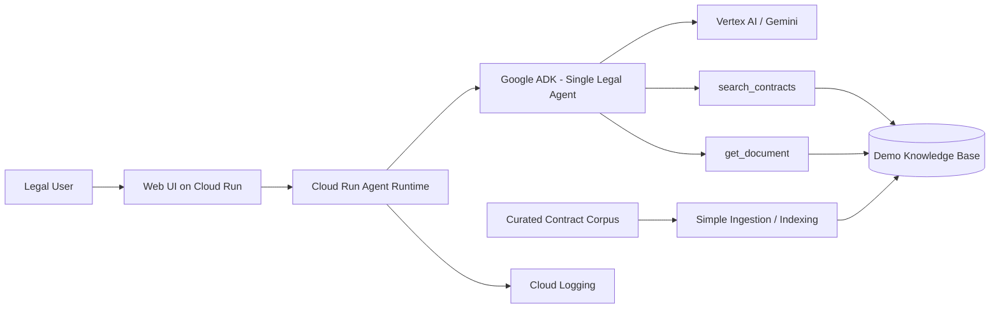

# GCP FAST DEMO Architecture — Legal Contract Agent

## Executive intent

Prove legal question-answering, clause analysis, comparison and source traceability with the fewest moving parts.

## Baseline



## Component rationale

| Concern | FAST DEMO choice | Why |
|---|---|---|
| Web UI | Cloud Run | Managed, fast to deploy, scale-to-zero friendly |
| Agent runtime | Cloud Run Service | Request-driven workload |
| Agent framework | Google ADK | Proven GCP-native agent structure |
| Model | Vertex AI / Gemini | Core reasoning capability |
| Retrieval | Lightweight vector/retrieval layer | Enough to validate RAG value |
| Documents | Curated digital corpus | Keeps demo deterministic |
| Logs | Cloud Logging | Minimum diagnosability |
| Secrets | environment/secret mechanism appropriate to deployment | Never hard-code credentials |

## Runtime flow

```text
Question
  ↓
Legal Agent
  ↓
search_contracts
  ↓
Top-k evidence
  ↓
Gemini grounded reasoning
  ↓
Answer + evidence
```

For comparison:

```text
Comparison question
  ↓
Legal Agent
  ↓
search_contracts(document A)
  ↓
search_contracts(document B)
  ↓
bounded evidence from both
  ↓
Gemini comparison
  ↓
differences + evidence A + evidence B
```

## Minimal deployment rules

- Cloud Run remains the default runtime.
- Prefer one service for the agent/API; a separate frontend service is optional if it simplifies UI development.
- Keep the agent stateless between sessions unless the demo requires temporary conversation context.
- Use one model configuration.
- Keep retrieval top-k bounded.
- Keep tools read-only.
- Enable basic request/error logging.
- Provide a health endpoint.
- Provide a smoke test.

## Evolution triggers

Move beyond FAST DEMO only when evidence shows a need.

### Add OCR
When scanned PDFs are a required part of the validated use case.

### Add SharePoint
When the demo has proven value and source-system permission-aware retrieval becomes necessary.

### Add hybrid retrieval / reranking
When golden-set failures show semantic retrieval alone is insufficient.

### Add structured legal metadata
When questions require reliable filtering by party, date, contract type, clause type or company.

### Add GraphRAG
When cross-document relationship queries cannot be handled reliably with metadata + retrieval.

### Add multi-agent
When specialist capabilities require separate contracts, permissions, scaling or independent evaluation.

### Add AgentOps
At MVP/Product maturity when trace, quality, cost, release evidence and operational governance become product requirements.
