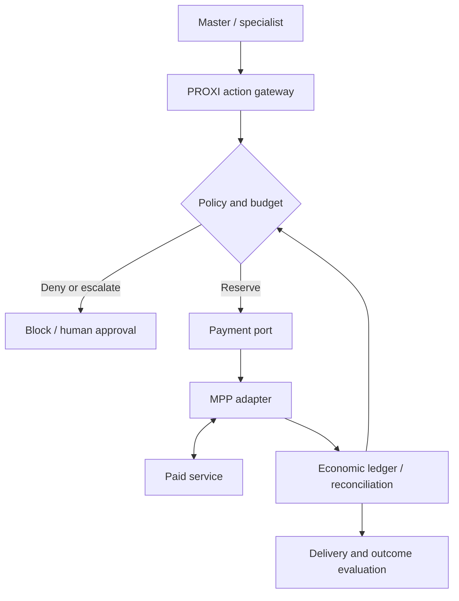

# Pack — Governed Agent Payments

Status: PROPOSED / documentation baseline, 2026-10-08.
Evidence: architectural design; no payment runtime or production validation is claimed.

## Intent
Enable agents to acquire paid capabilities within explicit delegated authority, deterministic policies and aggregate budgets. MPP is an optional payment adapter, not the policy engine.

## Placement
Agentic economics owns allocation, pricing, payments, reconciliation and value.
PROXI is the proposed runtime enforcement point; the Master retains business orchestration.
MCP exposes tools; A2A enables agent collaboration; MPP handles payment exchanges for compatible services. These responsibilities complement each other.

## Compose with
- [Governed Agent](governed-agent.md)
- [Multi-Agent Manager](multi-agent-manager.md)
- [Evaluation & Observability](eval-observability.md)
- [Human-in-the-Loop](human-in-the-loop.md)
- [Architecture](../architecture/README.md)

## Use / avoid
Use when an agent can purchase external services or create economic commitments.
For internal consumption billed through corporate accounts, start with cost attribution and budgets. MPP is not mandatory.

## Deterministic invariants
- Available = approved budget - recorded consumption - active commitments, within one currency and accounting scope.
- Reserve and check atomically before execution. An analytical dashboard is not the transactional source of spending authority.
- Child allocations share the ancestor cap; delegation never creates additional authority. Prevent double-counting parent allocations and child consumption.
- Define transaction, task, agent, tenant and period limits; check all applicable scopes.
- Validate actual amount, recipient, currency/asset, expiry and resource binding; never authorize from descriptive text alone.
- Keep credentials outside prompts and model context; restrict network egress so agents cannot bypass enforcement.
- The agent cannot approve itself, raise limits or change allowlists.
- Approval binds exact terms, expiry, payer and resource; changed terms require reevaluation.
- An uncertain payment keeps its commitment until reconciled. Never release it or repay merely because a timeout occurred.
- Paid, settled, delivered, accepted, refunded and disputed are distinct states. A payment receipt does not certify result quality.
- Session top-ups and recurring renewals require fresh budget checks; canceling a run does not necessarily cancel a subscription.

## Logical contract (application-owned, not MPP wire fields)
SpendIntent: intent_id, task_id, agent_id, parent_agent_id, tenant_id, accountable_owner,
provider_id, resource_id, purpose, amount_minor, currency, expires_at, policy_version,
idempotency_key, trace_id.
Authorization: decision, reason, reservation_id, terms_hash, expires_at.
EconomicEvent: event_id, intent_id, reservation_id, payment_reference, event_type,
amount_minor, currency, timestamp, evidence_reference.
Use integer minor units with explicit currency precision. Include fees and FX rules when applicable.
Separate estimated, committed, paid, settled, billed and attributed values; they must not be summed as independent costs.

## Architecture

PROXI defines policies in its control plane and enforces them in the execution path.
Payment ports isolate provider dependencies when justified; the ledger must guarantee
atomic reservations and durable correlation. Settlement and local bookkeeping span
systems: use recoverable states and reconciliation rather than assuming one global transaction.

## MPP adapter
MPP means Machine Payments Protocol. A client receives payment conditions, fulfills them
through the selected method, and retries with a credential. Verification/settlement depends
on that method. HTTP uses 402 and Payment authentication; MCP has a JSON-RPC transport profile.
MPP is an evolving open protocol; do not describe its core as an approved IETF RFC.
Pin SDK/spec versions and verify supported methods/intents before implementation.

## Progressive delivery
| Stage | Required evidence |
|---|---|
| FAST DEMO | Synthetic data, simulated payments, allowlist and hard budget rejection |
| MVP | Sandbox, delegated authority, atomic reservations, safe retries and reconciliation |
| PRODUCT | Protected credentials, segregation, revocation, audit, failure recovery and operational evidence |

## Acceptance scenarios
1. Allowed provider and sufficient balance: one reservation and one purchase.
2. USD 10 remaining; two concurrent USD 6 intents: at most one authorization succeeds.
3. Child plus parent spending exceeds ancestor cap: reject before payment.
4. Amount, recipient, asset or terms change: previous approval cannot be reused.
5. Duplicate request: no additional settlement or repeated business side effect.
6. Timeout after submission: retain commitment and reconcile before retry.
7. Paid but invalid result: mark quality failure without pretending payment was reversed.
8. Expired/revoked authority or forbidden provider: block even if balance is sufficient.
9. Session top-up / renewal exceeds aggregate cap: deny extension.
10. Evidence contains references and redacted metadata, never raw payment credentials.

## Sources and ownership
Reviewed 2026-10-08:
- [MPP specifications](https://paymentauth.org/)
- [MPP source](https://github.com/tempoxyz/mpp-specs)
- [Cloudflare MPP documentation](https://developers.cloudflare.com/agents/tools/payments/mpp/)
- [Governance knowledge hub](https://github.com/JuliusCordova/portafoliodatagob/tree/main/docs/ai-governance)

Protocol mechanics are source-grounded; the budget model, PROXI placement and acceptance
scenarios above are proposed DevPattern architecture. No payment capability is implemented by this document.
